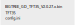
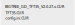

## Screen firmware update

This is a list of folders. The name of the folder represents the update date.

The files in the folder are bin files. 

## File name introduction

```
BIQU_TFT35_APP1_V2.0.27.x.bin
BIGTREE_GD_TFT35_V2.0.27.x

They are the firmware of two different screens. 
If you don't know which firmware to use, copy them all to the SD card. The update process will automatically select a firmware update.
```


## Update steps

1. Remove the SD card from the screen.
2. The format of the SD card is `FAT32`. please confirm.
3. If there is a residual file `xxxx.CUR` in the SD card, please delete it. It is the cache file generated during the last upgrade. If it is stored in the SD card, it may cause your upgrade to fail this time.
4. Copy `xxxx.bin` to the SD card (do not change the name). Then copy the folder `TFT35` and `config.ini` to the SD card.
PS: `reset.txt` is an empty text file. If your update is stuck at the last step and cannot jump to the menu, then copy it to the SD card and re-upgrade. )
5. Insert on the screen. Press the small black button on the screen, it is the reset button.
The automatic update begins.

&nbsp;


MT3X/Firmware/TouchScreen/imgs/after.svg


| Required files in SD card before update | Files in SD card after update |
| :--- | ---: |
|  |  |
|  In the next update, these files must be copied to the SD card. |In the next update, these files need to be deleted from the SD card.|

&nbsp;

**Steps to see if the update is successful,**
When the screen is successfully connected to the printer, proceed as follows,
`Info` -> `Menu` -> `Settings` -> `Info`,
Check the version displayed in the MULTOO Code item. For example, the display content is,
`MULTOO Code: V1.1.2`

If the version number changes, it means the update was successful.